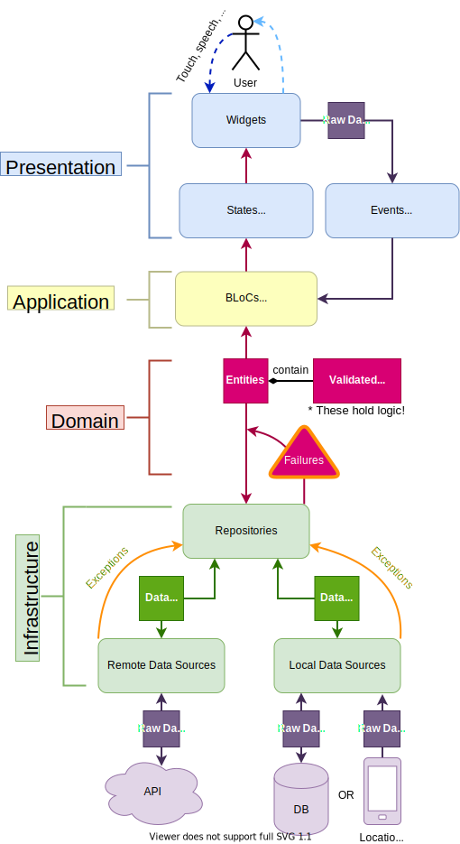

# ToDo App using Domain-Driven Design

![coverage][coverage_badge]
[![style: very good analysis][very_good_analysis_badge]][very_good_analysis_link]
[![License: MIT][license_badge]][license_link]

You have surely seen or built Flutter apps using Firebase Auth and FirebaseFirestore and I'm sure you didn't put the Firebase calls into your widget code. In other words, you used some sort of an architecture.

You may have used `Clean Architecture`, `MVVM`, `MVC` or many more. These patterns give you a project design strategy.

But How is Domain-Driven Design (DDD) different then?

Simply said, it's better on every level. We still have a good separation into layers which brings beautiful traits ease of navigation and testability. So no, we still don't put all of our code into the UI or state management

---

The diagram below outlines the key architectural layers present in a DDD Flutter app.



---

## Getting Started 🚀

This project contains 2 flavors:

- development
- production

To run the desired flavor either use the launch configuration in VSCode/Android Studio or use the following commands:

```sh
# Development
$ flutter run --flavor development --target lib/main_development.dart

# Production
$ flutter run --flavor production --target lib/main_production.dart
```

_\*ToDo App works on iOS, Android, and Web._
